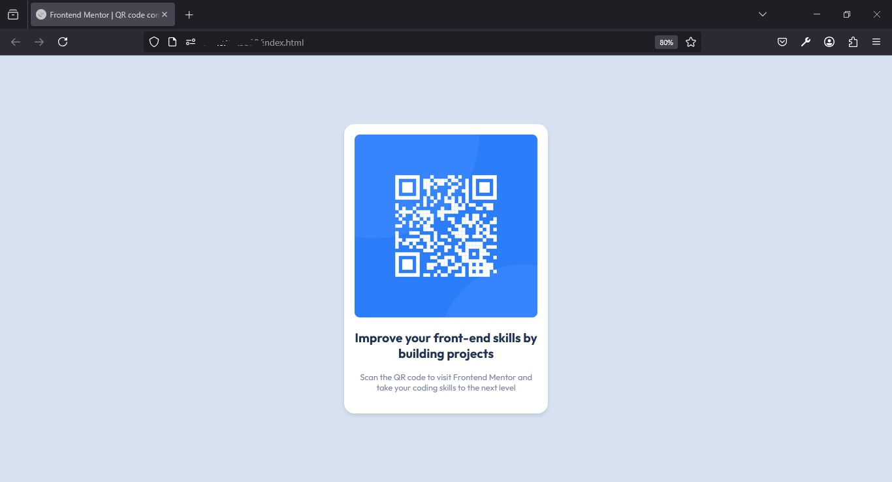

# Frontend Mentor - QR code component solution

This is a solution to the [QR code component challenge on Frontend Mentor](https://www.frontendmentor.io/challenges/qr-code-component-iux_sIO_H). Frontend Mentor challenges help you improve your coding skills by building realistic projects. 

## Table of contents

  - [Screenshot](#screenshot)
  - [Links](#links)
  - [Built with](#built-with)
  - [What I learned](#what-i-learned)
  - [Useful resources](#useful-resources)
  - [Author](#author)

### Screenshot

### Links

- Solution URL: https://github.com/isarojodev/qr-code
- Live Site URL: https://isarojodev.github.io/qr-code/

### Built with

- Semantic HTML5 markup
- CSS custom properties
- Flexbox
- CSS Grid
- Mobile-first workflow
-Responsive Design

### What I learned

This was my first project so I've been practicing the bases of HTML and CSS
I also learned how to use the MQ

### Useful resources

- [Example resource 1](https://www.frontendmentor.com) - 
- [Example resource 2](https://www.deepseek.com) - 

## Author

- Frontend Mentor - [@isarojodev](https://www.frontendmentor.io/profile/isarojodev)

